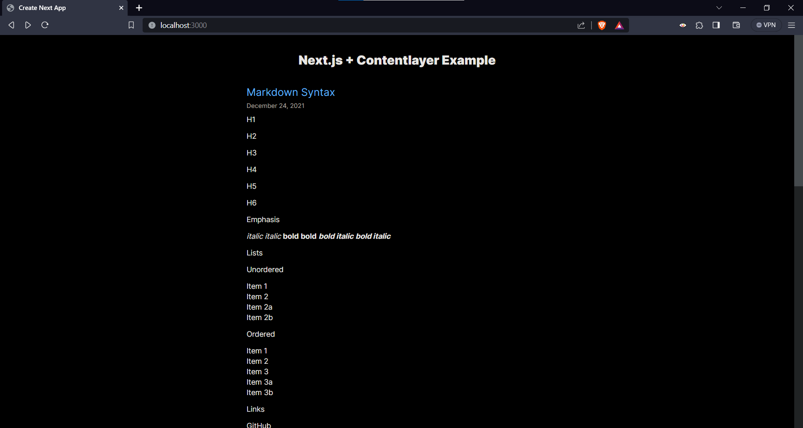

## NextJS Project Setup

```bash
npx create-next-app@latest
```

- ✅ Typescript, ✅ Tailwind, ✅ ESLint

- NOTE: I later realised that I should've used `@13.5.1` instead of `@latest` because [Contentlayer](#contentlayer) (which we add later) doesn't support the latest version of NextJS yet.

## Next and MDX (from the Next website)

## Contentlayer

> [Contentlayer](https://contentlayer.dev/) is a library that makes it easy to manage content in Next.js applications. Basically, I'm using it cause there's more documentation on it, it is easier to add remark and rehype plugins to the MDX and seems to be used by other documentations websites that are using the latest versions of Next (with the `app` router) so yay

I basically followed the [docs](https://contentlayer.dev/docs/getting-started-cddd76b7#2-define-content-schema) exactly except for the following:

- (:warning: pretty important but wasn't in docs) Added `concurrently` and run `contentlayer dev` with `next dev` in the `npm run dev` script
  - Install `concurrently`:
    ```bash
    npm install concurrently
    ```
  - Change `npm run dev` script in `package.json`:
    ```json
    // 📄 package.json
    {
      ...
        "scripts": {
            "dev": "concurrently \"contentlayer dev\" \"next dev\""
            ...
        }
    }
    ```
- changed the test markdown file to have more markdown features to view all markdown features:

  ````md
  ---
  title: Markdown Syntax
  date: 2021-12-24
  ---

  # H1

  ## H2

  ### H3

  #### H4

  ##### H5

  ###### H6

  ## Emphasis

  _italic_ _italic_
  **bold** **bold**
  **_bold italic_** **_bold italic_**

  ## Lists

  ### Unordered

  - Item 1
  - Item 2
    - Item 2a
    - Item 2b

  ### Ordered

  1. Item 1
  2. Item 2
  3. Item 3
  4. Item 3a
  5. Item 3b

  ## Links

  [GitHub](http://github.com)

  ## Images

  

  ## Code and Syntax Highlighting

  Inline `code` has `back-ticks around` it.

  ```javascript
  var s = "JavaScript syntax highlighting";
  alert(s);
  ```

  ## Tables

  | Syntax    | Description |
  | --------- | ----------- |
  | Header    | Title       |
  | Paragraph | Text        |

  ## Blockquotes

  > Blockquotes are very handy in email to emulate reply text.
  > This line is part of the same quote.

  ## Inline HTML

    <dl>
      <dt>Definition list</dt>
      <dd>Is something people use sometimes.</dd>
    </dl>

  ## Horizontal Rule

  ---

  ---

  ---

  ## Line Breaks

  Line 1<br />Line 2

  ## YouTube Videos

  [](https://www.youtube.com/watch?v=6A5EpqqDOdk)

  ## Emoji

  :smile:
  :laughing:
  :blush:

  ## Task Lists

  - [x] Task 1
  - [x] Task 2
  - [ ] Task 3

  ## Math

  ```math
  Inline math $a^2+b^2=c^2$ inline math.
  $$\sqrt{a^2 + b^2}$$
  ```
  ````

And managed to get the following result:


* MDX Stuff
* Following [this doc](https://contentlayer.dev/docs/sources/files/mdx-d747e46d)
  * The `useMDXComponent` didn't seem to be working, gave me this error:
    * TODO image of error
  * So I followed [this repo's `page.tsx`](https://github.com/kfirfitousi/blog/blob/prod/app/%5B...slug%5D/page.tsx#L30) 
* Adding GitHub Flavoured Markdown
    ```bash
    npm install remark-gfm
    ```
* Downgraded to `"remark-gfm": "^3.0.1",` because of [this issue](https://github.com/remarkjs/react-markdown/issues/771)